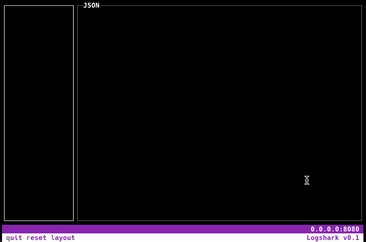

<kbd></kbd>

# logshark

Logshark is a debugger for JSON logs.

Logshark works by listening for logs on an HTTP port, it mimicks the Elasticsearch protocol so as to receive data from Beats (Filebeat, Metricbeat, Heartbeat, etc.) and Logstash using the standard elasticsearch output. 

Features:
- Terminal UI 
- Navigable list of logs 
- Highlightable, pretty printed JSON
- 🎨 Colorful
- Beats/Logstash integration
- Stats such as *Events per second* and *Average size* in bytes per event - useful for calculating bulk/batch size

## Download

Latest Release [here](/ugosan/logshark/releases/latest/download/logshark)

## How to use

```perl
./logshark --host 127.0.0.1 --port 9200 --max 1000
```